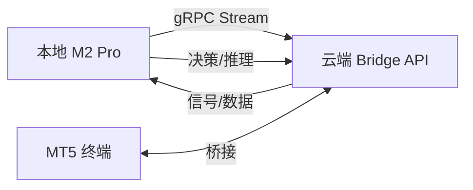

# Phase 5: AI-Driven Alpha - Implementation Roadmap

此文档用于追踪 Phase 5 (AI 信号过滤与元标注) 的实施进度。

## 🎯 新增：分布式 AI 架构 (Distributed AI Architecture)

我们采用了 **本地 M2 Pro 推理 + 云端 Bridge 转发** 的架构，充分利用本地算力并保持云端部署的灵活性。

### 架构拓扑

- **Cloud Bridge (Server)**: 负责从 MT5 接收数据，通过 gRPC 广播给连接的客户端。
- **Local AI Engine (Client)**: 运行在高性能 M2 Pro 上，接收原始数据，计算特征，执行推理，返回决策。

### 双模式支持
1. **模式A: 纯AI信号生成 (Pure AI Mode)**: 本地 AI 分析市场微观结构，主动生成信号。
2. **模式B: 指标+AI过滤 (Indicator + AI Filter Mode)**: 云端转发指标信号，本地 AI 进行二次确认。

## 1. 基础设施搭建 (Infrastructure)
- [x] **1.1 Python 依赖升级**
    - 添加 `lightgbm`, `pandas`, `numpy`, `scikit-learn`, `grpcio`, `protobuf` 到 `requirements.txt`。
- [x] **1.2 数据库架构设计**
    - 创建 `src/db/FULL_SCHEMA_V2.sql`，包含 `training_datasets` 表和 `automation_rules` 表的 AI 字段。
    - 补全 `trades` 表的 `mae`/`mfe` 字段。
    - 修复 RLS (Row Level Security) 权限问题。
- [x] **1.3 数据库整合**
    - 合并所有历史 SQL 文件为单一真理来源 `FULL_SCHEMA_V2.sql`。

## 2. gRPC 通信协议 (Protocol)
- [x] **2.1 定义 Proto 文件**
    - 创建 `src/proto/alphaos.proto`，定义 `SignalRequest` (Market Context, Signal Source) 和 `SignalResponse` (Action, Confidence)。
- [x] **2.2 生成代码**
    - 生成 Python gRPC 桩代码。
    - 实现 Docker 容器启动时的自动代码生成脚本。

## 3. 云端 Bridge 改造 (Cloud Side)
- [x] **3.1 gRPC Server 实现**
    - 实现 `grpc_server.py`，支持双向流式通信。
    - 管理客户端连接，处理心跳和异常断开。
- [x] **3.2 信号转发逻辑**
    - 改造 `AutomationManager`，当收到 MT5 信号时，打包历史数据 (H1 Candles) 推送到 gRPC 流。
    - 实现异步等待 AI 决策响应，带超时处理。
- [x] **3.3 部署与运维**
    - 更新 `docker-compose.yml` 暴露 50051 端口。
    - 优化 `deploy_service.sh`，支持针对性部署和 Docker 缓存清理（解决低内存服务器 OOM 问题）。
    - 添加详细的 Debug 日志和错误追踪，解决 Supabase 写入权限问题。

## 4. 本地 AI 引擎 (Local Side)
- [x] **4.1 客户端开发**
    - 创建 `ai-engine` 项目目录。
    - 实现 `src/client.py`，包含自动重连、心跳保持。
- [x] **4.2 特征工程与推理**
    - 实现基础特征计算 (OHLCV, MA, RSI)。
    - 集成 LightGBM 模型（目前为 Dummy Model，待数据积累后训练）。
- [x] **4.3 运行环境**
    - 编写 `run_ai.sh` 和 `setup_local.sh`，简化本地启动流程。

## 5. 前端与交互 (Frontend)
- [x] **5.1 AI 模式配置**
    - `AutomationRules` 组件增加 AI 模式选择 (Legacy/Indicator AI/Pure AI) 和信心阈值设置。
- [x] **5.2 信号展示**
    - `SignalListener` 解析后端传递的 AI 决策备注，Toast 弹窗显示 "AI 推荐" 或 "AI 拒绝"。

## 6. 部署与验证 (Deployment & Verification)
- [x] **6.1 全链路联调**
    - 验证：MT5 -> Bridge -> Local AI -> Bridge -> Supabase -> Frontend 的完整数据流。
    - 修复：gRPC 连接问题、RLS 权限拒绝问题、Schema 字段缺失问题。
- [x] **6.2 压力测试**
    - 通过 CURL 模拟高频信号注入，验证系统稳定性和数据库写入能力。

## 7. 后续计划 (Model Training - 待数据积累)
- [ ] **7.1 数据积累**
    - 运行系统 1-2 周，收集包含 `market_context` 和真实盈亏标签的训练数据。
- [ ] **7.2 模型训练**
    - 开发本地训练脚本，训练真实的 LightGBM 分类模型。
- [ ] **7.3 模型热更新**
    - 实现模型文件的版本管理。
