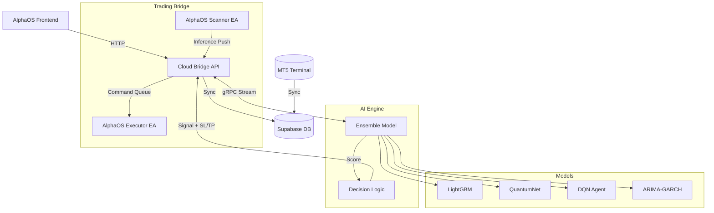

# AlphaOS - MT5 智能交易管理系统

> 一个现代化的 MT5 交易管理和分析平台，集成实时交易执行、数据分析、交易日志以及**分布式 AI 高频交易**功能。

---

## 📋 目录

- [核心特性](#核心特性)
- [系统架构](#系统架构)
- [快速开始](#快速开始)
- [功能模块](#功能模块)
- [部署指南](#部署指南)
- [技术栈](#技术栈)

## 📂 项目结构

```text
alpha-os/
├── ai-engine/                  # [AI] 本地 AI 推理与训练引擎
│   ├── models/                 #     LightGBM 模型 (Scalping V2, Scanner V1)
│   ├── src/                    #     gRPC 客户端与特征计算逻辑
│   │   ├── client.py           #         主客户端（集成 QuantumNet/LGBM/DQN/ARIMA）
│   │   ├── features.py         #         微结构与技术特征工程
│   │   └── models/             #         模型定义 (DQN, QuantumNet, TimeSeries)
├── trading-bridge/             # [Backend] 交易桥接层
│   ├── docker/                 #     Bridge API 与 MT5 容器配置
│   ├── mql5/                   #     MetaTrader 5 策略与指标
│   │   ├── AlphaOS_Executor.mq5 #        [NEW] 订单执行与账户状态上报 EA
│   │   ├── AlphaOS_Scanner.mq5  #        [NEW] 市场扫描与 AI 推理触发 EA
│   │   ├── BridgeEA.mq5        #         (Legacy) 综合执行 EA
│   │   └── PivotTrendSignals.mq5 #       信号生成指标
│   └── src/                    #     FastAPI + gRPC 服务源码
├── src/                        # [Frontend] Next.js Web 应用
│   ├── app/                    #     App Router 页面
│   ├── components/             #     React 组件 (Charts, Dashboard)
│   ├── db/                     #     Supabase SQL Schema
│   └── proto/                  #     gRPC 协议定义 (.proto)
├── deploy_orb.sh               # 远程部署脚本
└── train_pipeline.sh           # AI 训练自动化流水线
```

---

## ✨ 核心特性

### 1. 🧠 1-5分钟高频 AI 架构 (New)

专为短线剥头皮（Scalping）设计的全新架构，响应速度 < 50ms。

- ✅ **集成模型 (Ensemble)**:
    - **LightGBM Online**: 基于 34 个核心特征的快速趋势过滤。
    - **QuantumNet-Lite**: 深度学习模型，捕捉 120 步历史序列的时序形态。
    - **DQN Agent**: 强化学习智能体，基于 50 维微结构状态（成交量冲击、订单失衡）进行博弈决策。
    - **Phase 7: Jump/Citadel Optimization (Intel Mac & L1 Data)** `[IN PROGRESS]`
      - **Feature**: Synthetic Microstructure (`absorption_ratio`, `tick_velocity`) to simulate L2 data.
      - **Compute**: ONNX Runtime acceleration for Intel CPU inference (3-5x speedup).
      - **Risk**: Time-Based Exit ("Stalemate" logic) & Spread Protection.
    - **Streaming ARIMA-GARCH**: 实时波动率预测，动态计算 SL/TP 止损止盈。
- ✅ **微结构特征**: 引入 Volume Shock、Order Imbalance、Spread/ATR 等高频特征。
- ✅ **反事实训练 (Virtual Training)**: 独创的“时光机”技术，将历史 WAIT 信号转化为虚拟交易数据，大幅扩展训练集 (14x)。
- ✅ **智能反手**: 支持 AI 信号反转时自动平仓并反手开单。
- ✅ **防过量交易**: 同一品种同方向最多 2 单，叠加全局最大持仓上限。
- ✅ **动态风控**: 基于 ARIMA-GARCH 预测波动的动态 SL/TP，及 **AI-Kelly** 动态仓位管理，极端波动自动拒单。

### 2. 🔗 双 EA 桥接架构 (AlphaBridge)

- ✅ **AlphaOS_Scanner**: 专注于市场数据扫描，新 K 线生成时毫秒级触发 AI 推理。
- ✅ **AlphaOS_Executor**: 专注于订单执行与状态上报，支持部分状态合并更新。
- ✅ **ZeroMQ/HTTP 高速通信**: 实现毫秒级指令传输。
- ✅ **Docker 容器化**: MT5 终端 + Wine 环境 + Python API 桥接。

### 3. 📊 智能仪表盘

- ✅ **实时全状态同步**: 同时展示来自 Scanner 的实时价格和 Executor 的账户净值。
- ✅ **AI 决策可视化**: 显示 AI 置信度 (Score)、延迟 (Latency) 及动态止损止盈位。
- ✅ **交易统计分析**: 总盈亏、胜率、盈亏比、最大回撤。
- ✅ **持仓订单管理**: 实时持仓显示，一键平仓。

### 4. 📝 交易日志 (Journal)

- ✅ **自动化归档**: 每一笔 AI 交易自动记录到 Supabase 数据库。
- ✅ **训练闭环**: 交易结果（盈亏、MAE/MFE）自动回传，用于后续 AI 模型训练。
- ✅ **月度日历视图**: 直观展示每日交易盈亏。

---

## 🏗 系统架构



### 分布式拓扑
- **Cloud (Remote)**: 运行前端、Bridge API、MT5 容器（运行 EA）和 Supabase。负责数据路由和持久化。
- **Local / AI Server**: 运行 AI Engine。利用 CPU/GPU 进行多模型并行推理。

---

## 🚀 快速开始

### 前置要求

- **Node.js**: >= 18.0
- **Docker**: 用于部署 MT5 Bridge
- **Supabase**: 数据库账户
- **Python 3.9+**: 用于本地 AI 引擎

### 1. 部署 (远程)

项目使用 `deploy_orb.sh` 脚本进行远程一键部署。

```bash
# 部署所有服务（AI, Bridge, Web, Supabase）
./deploy_orb.sh

# 仅部署特定服务
./deploy_orb.sh --ai --bridge --web

# 部署本地 Supabase（首次需要）
./deploy_orb.sh --supabase

# 从云端迁移数据到本地
./deploy_orb.sh --migrate
```

**重要配置**：
- 网络统一：所有服务运行在 `alphaos-net` 网络，支持容器名互访
- 端口配置：
  - Web: `3001`
  - Bridge API: `8000`
  - AI Engine: `50051`
  - MT5 VNC: `3000`
  - Supabase Studio: `54323`
  - Supabase API: `54321`
  - Supabase DB: `54322`


### 2. EA 挂载

1.  **编译 EA**: 使用 MetaEditor 编译 `AlphaOS_Scanner.mq5` 和 `AlphaOS_Executor.mq5`。
2.  **挂载 Scanner**: 在目标交易品种（如 BTCUSD 1m）图表上挂载 `AlphaOS_Scanner`。
    *   *功能*: 负责监听行情，触发 AI。
3.  **挂载 Executor**: 在任意图表上挂载 `AlphaOS_Executor`。
    *   *功能*: 负责接收 AI 信号下单，上报账户资金。

---

## 📚 文档索引

### 📘 已完成文档 (Completed)

- **[开发备忘录](docs/DEVELOPMENT_LOG.md)**
  > **开发必读**。记录所有重要的开发决策、问题解决过程和系统优化历史。
- **[反事实MFE成功报告](docs/COUNTERFACTUAL_MFE_SUCCESS.md)** 🎉
  > **重大突破**。成功实现反事实MFE计算，85%成功率，解决7.4:92.6类别不平衡问题。
- **[反事实MFE优化计划](docs/COUNTERFACTUAL_MFE_PLAN.md)**
  > **性能优化方案**。包含批量查询、物化视图等优化建议（已基本实现，可选）。
- **[部署与迁移指南](docs/DEPLOYMENT_GUIDE.md)**
  > **运维必读**。涵盖网络统一架构、一键部署流程、云端数据迁移及常见故障排查。
- **[AlphaOS 官方完全手册](docs/ALPHAOS_OFFICIAL_MANUAL.md)**
  > **核心必读 (SSOT)**。整合了产品手册、技术架构与 API 参考，是项目的单一真理来源。
- **[产品使用手册](docs/PRODUCT_MANUAL.md)**
  > 面向最终用户。包含系统安装、MT5 连接、仪表盘操作指南及 AI 模式配置说明。
- **[项目技术文档](docs/PROJECT_DOCUMENTATION.md)**
  > 面向开发者。详细说明了 Next.js 前端、FastAPI Bridge 与本地 AI 引擎的技术实现。

---

## 📝 更新日志

### v2.6.0 (2025-12-12) - 网络统一 & 本地化部署
- ✅ **网络架构优化**:
    - 统一所有服务至 `alphaos-net` 单一网络，简化服务间通信
    - Supabase 使用 `docker-compose.override.yml` 双网络模式，兼容内部服务与外部调用
- ✅ **本地 Supabase 部署**:
    - 支持一键部署本地 Supabase 容器，端口自动避让（54321/54322/54323）
    - 完整数据持久化至 `~/alpha-os-data/supabase`
- ✅ **云端数据迁移**:
    - 新增 `--migrate` 标志，支持从云端 Supabase 迁移数据至本地
    - 自动应用云端数据库 schema至本地实例
    - 成功迁移 2000+ 条生产数据（signals, trades, automation_rules 等）
- ✅ **部署优化**:
    - 修复 Docker 构建时环境变量注入问题（Web/AI/Bridge 统一修复）
    - 本地 `.env.local` 值在部署前展开，确保远程构建获得正确配置
- ✅ **文档完善**:
    - 新增部署故障排查文档（端口冲突、环境变量问题）
    - 更新部署脚本使用说明

### v2.2.0 (2025-12-06) - 1-5m 高频架构
- ✅ **高频 AI**: 引入 LightGBM + QuantumNet + DQN + ARIMA 四模型集成。
- ✅ **微结构特征**: 支持 Order Flow 和 Volatility Shock 特征。
- ✅ **双 EA 架构**: 拆分 Scanner 和 Executor，提升并发处理能力。
- ✅ **智能反手**: 完整的反手开仓与持仓限制逻辑，同向持仓硬限制 2 单。
- ✅ **风险与依赖加固**: AI 引擎固定 CPU 版 Torch（避免 CUDA 依赖），动态风控阈值支持环境变量收紧。

### v2.1.0 (2025-11-27) - AI 驱动版
**Phase 5: Distributed AI Architecture**
- ✅ **架构升级**: 引入 gRPC 分布式架构，实现 Local AI + Cloud Bridge。
- ✅ **AI 引擎**: 新增 `ai-engine` 模块，支持本地特征计算和推理。

---

### v2.3.0 (2025-12-08) - Intel/AMD Optimization & Regime Switching
- ✅ **性能优化 (Performance)**:
    - **Polars 核心**: 全面替换 Pandas 为 Polars (Rust)，特征计算速度提升 20x。
    - **Async Process Pool**: 实现 CPU 密集型任务的异步进程池卸载，彻底解决 gRPC 事件循环阻塞。
- ✅ **策略增强 (Intelligence)**:
    - **Regime Switching**: 新增市场状态识别 (Trend/Range/Volatile)。
    - **Dynamic Enforcement**: 基于 ADX 和 ATR% 动态调整模型权重（趋势期重注 QuantumNet，震荡期重注 DQN）。
- ✅ **鲁棒性修复 (Robustness)**:
    - **Time Bias Fix**: 修复 Look-Ahead Bias，强制使用 K 线时间戳而非系统时间。
    - **Warm-up Gate**: 新增冷启动数据完整性检查 (<50 bars 自动等待)。

### v2.4.0 (2025-12-09) - AI Governance & Data Pipeline
- ✅ **策略迁移 (AI Migration)**:
    - **Reclaim Strategy**: 将核心趋势反转策略（Reclaim）完全迁移至 AI Engine 内部实现。
    - **Unified Logic**: AI Engine 成为唯一决策中心，消除“双脑”决策冲突。
    - **Data-Rich Signals**: 即使是规则型交易也具备完整的 AI 微观特征数据。
- ✅ **全链路数据闭环 (Data Loop)**:
    - **Full Recording**: 无论执行与否（SCAN/WAIT/TRADE），所有 AI 推理记录（特征+决策）均完整存入 Supabase。
    - **Consistency**: 修复了数据库与日志的 SL/TP 记录一致性，确保训练数据零误差。
    - **Auto-Learning Ready**: 为 Auto-Learner 构建了包含正负样本的高质量数据集。

### v2.5.0 (2025-12-10) - AI-Driven Kelly Position Sizing
- ✅ **AI 驱动仓位管理 (Smart Sizing)**:
    - **Dynamic Kelly**: 结合凯利公式 (Kelly Criterion) 与 AI 实时信心分数 (Confidence Score)，动态计算每笔交易的最佳仓位。
    - **Confidence Linking**: 高信心信号自动加大仓位，低信心信号自动降权，实现收益最大化与风险最小化的平衡。
    - **Circuit Breaker**: 新增每日最大亏损熔断机制，触及阈值自动停止开仓。
- ✅ **前端可视化配置**:
    - 在自动化策略矩阵中新增凯利系数、回溯交易周期、最大手数及每日风控的完整配置面板。

### v2.7.0 (2025-12-13) - Data Separation & Virtual Training
- ✅ **数据治理 (Data Separation)**:
    - 物理隔离真实交易 (`training_signals`) 与 市场扫描负样本 (`market_scans`)。
    - 保证实盘数据的绝对纯净，同时保留海量未执行信号用于训练。
- ✅ **虚拟训练 (Counterfactual Training)**:
    - 实现 `enhance_features.py` 内部仿真引擎，利用历史 SL/TP 进行“反事实”推演。
    - 成功将 1.5万条 WAIT 信号转化为带盈亏标签的有效数据，训练出 Model v3 (R2 指标首次转正)。
- ✅ **模型版本控制 (Versioning)**:
    - 实现 `v1 -> v2 -> v3` 自动递增与指针管理，支持 `--reset` 重置训练。
- ✅ **性能监控 (Monitoring)**:
    - 上线 `monitor_performance.py`，提供实时 Win Rate、PnL 及 AI 决策分布 (BUY vs WAIT) 的 ASCII 看板。

---

## 📄 许可证

私有项目 - 保留所有权利
