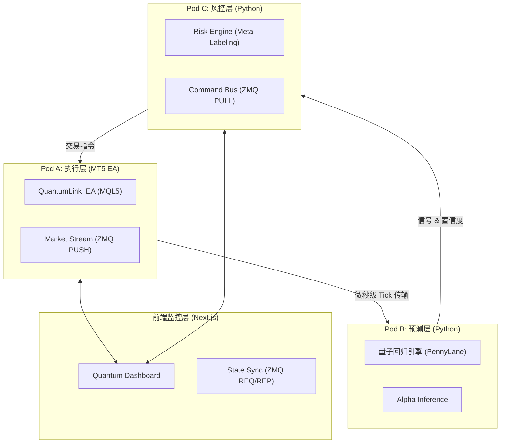

# Alpha-OS: 生产级 XAUUSD 量子高频交易系统

> **基于 Apple M2 Pro 架构优化的全栈式自动化交易解决方案**

[](https://github.com/aboutblank007/alpha-os)
[](LICENSE)
[](docs/M2%20Pro%20量子回归训练指南.md)

---

## 🌌 系统愿景

Alpha-OS 是一套深度整合了**量子机器学习 (QML)** 与**高频交易 (HFT)** 技术的生产级实盘系统。它专门针对 Apple M2 Pro 芯片的统一内存架构 (UMA) 进行底层优化，通过真量子电路回归引擎捕捉 XAUUSD（黄金）市场中极其细微的阿尔法机会。

---

## 🏗️ 核心架构：量子-经典双优侧车模式 (Sidecar)

系统采用 **Pod A/B/C 三位一体**架构，实现了执行、推理与风控的物理级隔离。



---

## ✨ 核心特性

- **🧠 真量子电路引擎 (PQC)**: 使用 PennyLane `lightning.qubit` 实现变分量子电路 (VQC)，基于 **Float64** 双精度运算，彻底规避 GPU 加速带来的梯度漂移。
- **🛡️ 三道风控防线**:
  1. **元标记 (Meta-Labeling)**: 预测“量子模型当前信号是否可靠”。
  2. **凯利公式 (Kelly Criterion)**: 动态计算每笔交易的最佳仓位规模。
  3. **微观结构风控 (L-VaR)**: 实时计算预期收益 vs 隐含滑点，自动否决负 EV 交易。
- **⚡ Q-Link 通信协议**: 基于 ZeroMQ 的自定义低延迟协议，实现 MT5 与 Python 引擎间的微秒级数据交换。
- **🖥️ M2 Pro 深度优化**: 
  - **核心绑定 (Core Pinning)**: 强制推理引擎运行在 Firestorm P-Cores，风控运行在 E-Cores。
  - **统一内存高效调度**: 利用 UMA 减少张量拷贝开销。
- **📊 实时监控看板**: 使用 Next.js + Tailwind CSS 构建的高级仪表盘，实时显式 AI 置信度、系统生命体征及交易链路延迟。

---

## 📂 项目结构

| 模块 | 目录 | 描述 |
| :--- | :--- | :--- |
| **量子引擎** | `quantum-engine/` | 核心 AI/QML 推理与训练引擎。 |
| **交易桥接** | `quantum-engine/qlink/` | ZeroMQ 通信通道、风险引擎与 API 网关。 |
| **执行端** | `quantum-engine/mql5/` | 挂载于 MT5 的高速 EA 与数据采集器。 |
| **前端大屏** | `src/` | Next.js 驱动的实时交易与分析仪表盘。 |
| **系统文档** | `docs/` | 包含 M2 Pro 优化、训练指南及实盘落地方案。 |

---

## 🚀 快速启动

### 1. 环境准备 (macOS / M2 Pro)
确保已安装 Python 3.9+ 及 Homebrew。

```bash
# 安装 Python 依赖
cd quantum-engine
pip install -r requirements.txt
```

### 2. 启动核心引擎
使用预置的启动脚本，它将自动执行**核心绑定策略**：

```bash
cd quantum-engine/qlink
chmod +x launch.sh
./launch.sh
```

### 3. MT5 EA 部署
1. 将 `quantum-engine/mql5/QuantumLink_EA.mq5` 拷贝至 MT5 `Experts` 目录。
2. 确保在 MT5 设置中开启 `Allow DLL imports`。
3. 挂载 EA 至 XAUUSD 任意周期图表。

### 4. 启动前端仪表盘
```bash
npm install
npm run dev
# 访问 http://localhost:3000
```

---

## ⚙️ 硬件优化建议

为了压榨 **Apple M2 Pro** 的极限性能，建议在 `launch.sh` 中配置以下环境变量：

```bash
export OMP_NUM_THREADS=8    # 针对 P-Cores 数量优化
export OMP_PROC_BIND=true   # 锁定线程防止漂移
```

> [!IMPORTANT]
> **强力推荐**：始终在 **Scheme C（纯 CPU 方案）** 下运行，以获得金融级的数值稳定性。

---

## ⚖️ 免责声明

本系统为高风险量化交易工具。市场有风险，投资需谨慎。作者不对因使用本软件导致的任何财务损失负责。

---

**Alpha-OS - Empowering Trading with Quantum Intelligence.**
