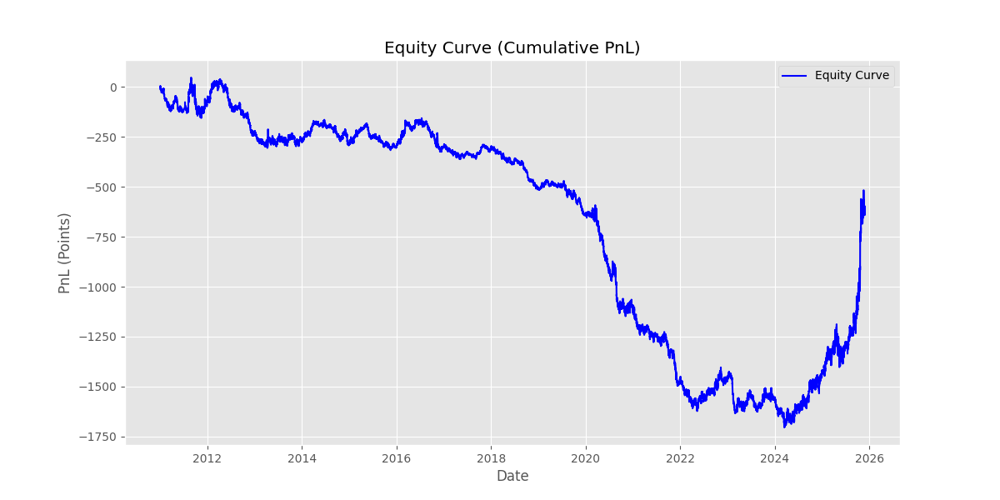
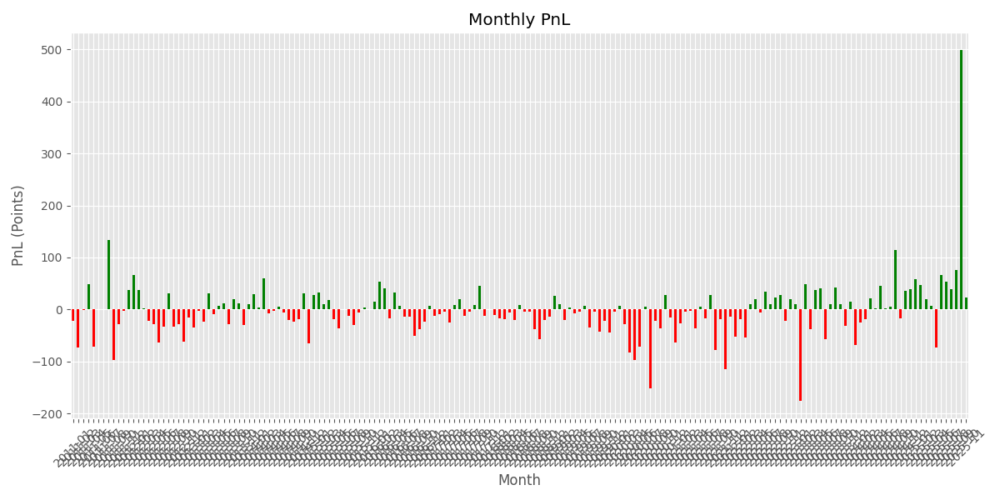
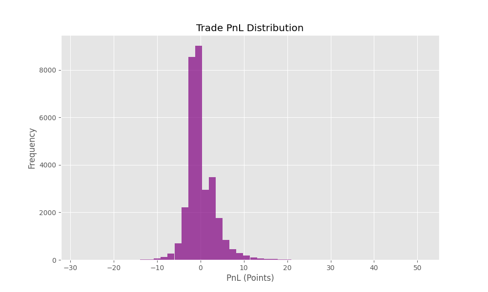

# Training Data Analysis Report

## Overview
This report analyzes the trading performance based on the `training_data.csv` file.

**Date of Analysis:** 2025-11-29

## Key Metrics

| Metric | Value |
| :--- | :--- |
| **Total Trades** | 31,205 |
| **Win Rate** | 32.79% |
| **Total PnL** | -606.53 Points |
| **Profit Factor** | 0.98 |
| **Average Win** | 3.71 Points |
| **Average Loss** | -1.84 Points |
| **Max Drawdown** | -1,752.84 Points |

## Performance Analysis

The strategy currently shows a **Profit Factor of 0.98**, indicating it is slightly unprofitable in its current state (losing slightly more money than it makes).

- **Win Rate vs. Risk/Reward**: The win rate is **32.79%**, which is typical for trend-following strategies. The **Average Win (3.71)** is approximately **2x** the **Average Loss (1.84)**. This positive risk/reward ratio is healthy, but the win rate needs to be slightly higher (or the risk/reward ratio improved further) to become profitable.
- **Drawdown**: The maximum drawdown is significant (-1,752.84 points), suggesting periods of sustained losses.

## Charts

### 1. Equity Curve
The equity curve shows the cumulative profit/loss over time.

### 2. Monthly PnL
This chart shows the profit or loss for each month, helping to identify seasonal performance or specific bad periods.

### 3. Trade PnL Distribution
The distribution of trade outcomes.

## Recommendations
1.  **Filter Optimization**: Since the Profit Factor is very close to 1.0 (0.98), small improvements in filtering out bad trades could flip the strategy to profitable.
2.  **Exit Strategy**: Analyze if trades are being held too long or cut too early. The 2:1 Reward:Risk is good, but maybe trailing stops could improve the win rate.
3.  **Market Conditions**: Check if the losses are concentrated in "choppy" market periods (low ADX).
