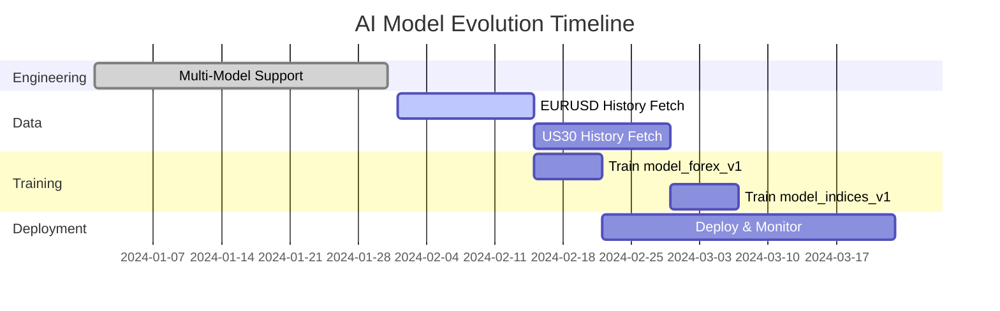

# AI Model Optimization & Evolution Plan

> AlphaOS 多资产类别智能模型演进路线图

---

## 1. 问题陈述 (Problem Statement)

当前系统依赖于一个主要基于 **XAUUSD (黄金)** 1分钟数据训练的单一 LightGBM 模型。将此模型直接应用于其他资产类别（外汇、指数、加密货币）存在重大风险，主要源于 **分布偏移 (Distribution Shift)**：

| 风险维度 | 说明 |
|---------|------|
| **波动率差异** | 黄金的 ATR/Price 比率与 EURUSD 显著不同 |
| **微观结构** | Tick成交量模式和流动性特征因资产而异 |
| **行为模式** | "假突破"和趋势持续性因资产类别而异 |

---

## 2. 工程基础 (Engineering Foundation) ✅ 已完成

为支持模型优化，**多模型架构 (Engineering Plan B)** 已实施：

### 已实现功能

| 组件 | 功能描述 |
|-----|---------|
| **Router** | `LocalAIEngine` 可根据交易品种动态选择模型 |
| **Configuration** | `models_config.json` 将品种（如 EURUSD）映射到特定模型文件 |
| **Hot-Reload** | 新模型可在不重启服务的情况下部署 |

---

## 3. 优化策略 (Optimization Strategy)

### Phase 1: 数据采集与标注 (Data Acquisition & Labeling)

在训练之前，必须构建多样化的数据集。

#### 目标资产

| 类别 | 品种 | 数据需求 |
|-----|------|---------|
| **商品** | XAUUSD (黄金) | ✅ 已有 |
| **外汇主要货币对** | EURUSD, GBPUSD, USDJPY | 需要 ~5年 M1 数据 |
| **指数** | US30, NAS100 | 需要 ~2年 M1 数据（因政策周期变化） |

#### 数据管道

```
┌─────────────────┐    ┌──────────────────┐    ┌─────────────────────┐
│   BridgeEA      │───▶│  Historical M1   │───▶│  training_datasets/ │
│  History Fetch  │    │  OHLC+TickVol    │    │  Symbol/Year/       │
└─────────────────┘    └──────────────────┘    └─────────────────────┘
```

**数据字段**: Open, High, Low, Close, TickVol, Spread

#### 标注方法 (Meta-Labeling)

1. 应用与黄金模型相同的 **Triple Barrier Method** (TP/SL)
2. 计算每个潜在信号的：
   - **MFE** (Maximum Favorable Excursion) - 最大有利偏移
   - **MAE** (Maximum Adverse Excursion) - 最大不利偏移

---

### Phase 2: 模型专业化 (Model Specialization)

为不同资产类别训练独立的"专家"模型。这是最安全的第一步。

| Model ID           | 目标资产                   | 训练数据焦点      | 目标              |
| ------------------ | ---------------------- | ----------- | --------------- |
| `model_gold_v3`    | XAUUSD                 | 100% 黄金历史数据 | 优化现有剥头皮逻辑       |
| `model_forex_v1`   | EURUSD, GBPUSD, USDJPY | 混合外汇主要货币对   | 捕捉低波动、均值回归特性    |
| `model_indices_v1` | US30, NAS100           | 美国指数        | 捕捉开盘/收盘时段的高动量行情 |

#### 🎯 Action Item

配置 `models_config.json` 将路由设置为：
```json
{
  "EURUSD": "model_forex_v1.txt",
  "GBPUSD": "model_forex_v1.txt",
  "USDJPY": "model_forex_v1.txt",
  "US30": "model_indices_v1.txt",
  "NAS100": "model_indices_v1.txt",
  "XAUUSD": "model_gold_v3.txt"
}
```

---

### Phase 3: "通用"模型 (Universal Model - Generalization)

一旦拥有专业化模型，尝试训练一个跨资产鲁棒的**通用模型**。

#### 技术方案

- **训练数据**: 包含所有资产的混洗数据集
- **特征工程**:
  - 确保所有特征已**平稳化**和**归一化**（已通过 Spread/ATR, Vol/Density 等实现）
  - 添加 `AssetClass` 类别特征：
    - `0` = Forex
    - `1` = Gold
    - `2` = Index

#### 优势

- 简化部署流程
- 捕捉通用市场物理规律（如：流动性缺口总会被填补）

---

### Phase 4: 在线学习 (Online Learning - Continuous Improvement)

#### 反馈循环

`DecisionLogger` 当前记录每个预测与实际结果的对比。

```
┌──────────────┐    ┌─────────────────┐    ┌──────────────────┐
│ AI Decision  │───▶│ ai_decisions.csv│───▶│ Weekly Retrain   │
│   Logger     │    │  (Predictions)  │    │    Script        │
└──────────────┘    └─────────────────┘    └──────────────────┘
                                                    │
                                                    ▼
                                           ┌──────────────────┐
                                           │ Updated Model    │
                                           │ Auto-Deploy      │
                                           └──────────────────┘
```

#### 重训练流程

1. **Weekly Script** 聚合 `ai_decisions.csv`
2. 计算 AI 建议的**已实现 PnL**
3. 将最近一周的数据添加到训练集
4. 重新训练并**自动更新模型文件**

---

## 4. 执行路线图 (Execution Roadmap)



### 详细步骤

| Step | 阶段 | 任务 | 状态 |
|------|-----|------|-----|
| 1 | **Engineering** | 实现多模型支持 | ✅ Done |
| 2 | **Data** | 运行 BridgeEA 历史数据抓取器获取 EURUSD 和 US30 | 🔥 Top Priority |
| 3 | **Training** | 使用 `ai-engine/train.py` 训练 `model_forex_v1` | ⏳ Pending |
| 4 | **Deploy** | 将 `model_forex_v1.txt` 放入 `ai-engine/models/` 并更新配置 | ⏳ Pending |
| 5 | **Monitor** | 对比 `model_gold` 与 `model_forex` 在 EURUSD 上的表现 | ⏳ Pending |

---

## 5. 风险控制 (Risk Control)

### 置信度阈值 (Confidence Thresholds)

外汇模型可能因较低波动率而输出较低概率。如需要，可按模型调整 `SCAN_CONFIDENCE_THRESH`：

```python
# models_config.json
{
  "EURUSD": {
    "model_file": "model_forex_v1.txt",
    "confidence_threshold": 0.55  # 可能需要降低
  },
  "XAUUSD": {
    "model_file": "model_gold_v3.txt",
    "confidence_threshold": 0.65  # 保持较高
  }
}
```

### 回退机制 (Fallback)

始终保留 `model_gold` 作为高置信度的专家模型备用。

---

## 6. 文件结构 (Directory Structure)

```
ai-engine/
├── models/
│   ├── lgbm_scalping_v1.txt      # Current Gold model
│   ├── model_gold_v3.txt         # Refined Gold model (future)
│   ├── model_forex_v1.txt        # Forex specialist (future)
│   └── model_indices_v1.txt      # Indices specialist (future)
├── models_config.json            # Symbol -> Model routing
├── training_datasets/
│   ├── XAUUSD/
│   │   ├── 2023/
│   │   └── 2024/
│   ├── EURUSD/
│   │   ├── 2019/
│   │   ├── 2020/
│   │   └── ...
│   └── US30/
│       ├── 2022/
│       └── 2023/
└── train.py                      # Training script
```

---

## 7. 总结 (Summary)

| 阶段 | 目标 | 预期收益 |
|-----|------|---------|
| Phase 1 | 数据采集 | 构建多资产历史数据库 |
| Phase 2 | 专业化模型 | 降低跨资产应用风险 |
| Phase 3 | 通用模型 | 简化运维，捕捉普适规律 |
| Phase 4 | 在线学习 | 持续优化，适应市场变化 |

---

*Last Updated: 2024-12*
*Author: AlphaOS Team*

