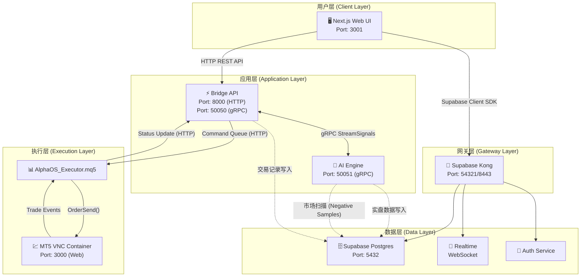
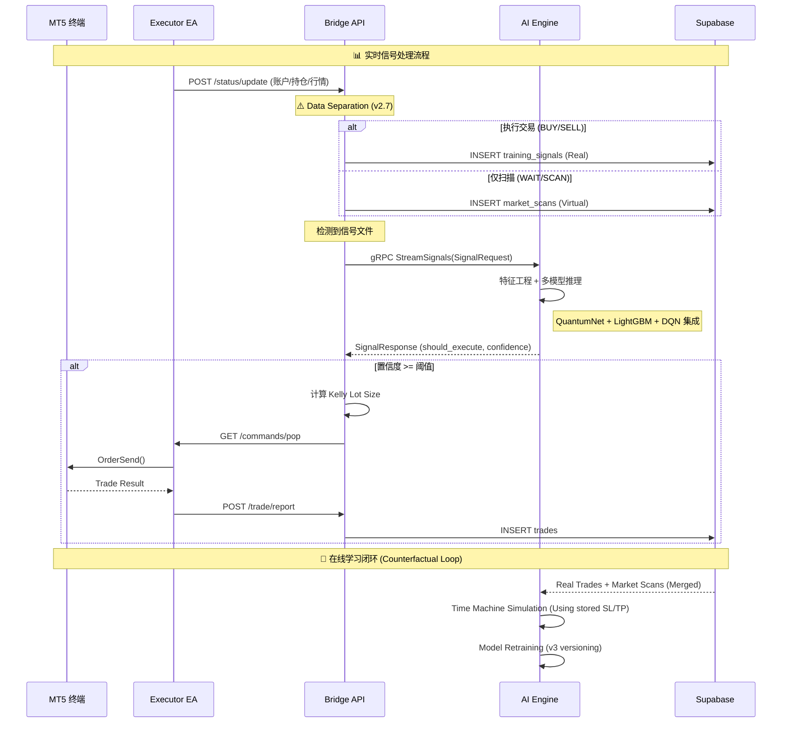

# AlphaOS 系统架构文档 V2

> **自动生成时间**: 2025-12-13 00:21 CST
> **扫描范围**: 全栈代码库（Next.js 前端、Python 交易桥、AI 引擎、Supabase 数据库）

---

## 1. 系统拓扑图 (System Topology)



---

## 2. 数据流向图 (Data Flow)



---

## 3. 通信协议定义 (Proto Interface)

### 3.1 服务定义

| 服务 | 方法 | 描述 |
|------|------|------|
| `AlphaZero` | `StreamSignals` | 双向流：Server 发送 SignalRequest，Client 返回 SignalResponse |
| `AlphaZero` | `HealthCheck` | Unary 调用：简单的 Ping/Pong 健康检查 |

### 3.2 核心消息结构

#### SignalRequest (请求 → AI)
| 字段 | 类型 | 描述 |
|------|------|------|
| `request_id` | string | 唯一请求标识 |
| `symbol` | string | 交易品种 (e.g., "EURUSD") |
| `timeframe` | string | 时间周期 (e.g., "PERIOD_M5") |
| `market_context` | Candle[] | 历史K线数据 (特征工程用) |
| `tick_data` | Quote | 实时买卖价 |
| `dom_bids/dom_asks` | DOMLevel[] | 订单簿深度数据 |
| `technical_context` | TechnicalContext | EA 预计算技术指标 (31个字段) |
| `action` | string | 原始信号 ("BUY"/"SELL") |

#### SignalResponse (AI → 响应)
| 字段 | 类型 | 描述 |
|------|------|------|
| `should_execute` | bool | 是否执行交易 |
| `action` | string | 最终动作 ("BUY"/"SELL"/"PASS") |
| `confidence` | double | 0.0-1.0 置信度 (回归模式为 MFE 预测值) |
| `adjusted_sl/tp/volume` | double | AI 优化后的止损止盈和手数 |
| `reason` | string | 决策可解释性说明 |

### 3.3 Proto 文件一致性检查

> [!WARNING]
> **发现不一致**：`src/proto/alphaos.proto` (135行) vs `ai-engine/src/proto/alphaos.proto` (129行)

**差异详情**：
- `src/proto` 的 `Candle` 消息包含微观结构字段：
  - `volume_real` (字段7)
  - `tick_count` (字段8)
  - `aggressor_buy` (字段9)
  - `aggressor_sell` (字段10)
- `ai-engine/src/proto` 的 `Candle` 缺少上述字段

**建议**：同步两个 Proto 文件，确保 gRPC 消息兼容性。

---

## 4. 数据库 Schema (Supabase) - v2.7 Updated

### 4.1 核心表结构

#### `market_scans` - 市场扫描表 (New) 🧠
用于存储 AI 拒绝的“负样本”，用于反事实训练。
| 关键字段 | 类型 | 说明 |
|----------|------|------|
| `signal_id` | text (PK) | symbol + timestamp |
| `ai_features` | jsonb | 完整 33 维特征向量 |
| `action` | text | 'WAIT' 或 'SCAN' |
| `signal_price` | numeric | 当时价格 |
| `sl/tp` | numeric | 假设的止损/止盈位 |

#### `price_timeseries_mv` - 价格视图 (Materialized View) ⚡
索引化的价格时间轴，加速回测。
`SELECT * FROM price_timeseries_mv WHERE symbol='XAUUSD' ORDER BY timestamp`

#### `trades` - 交易记录表 (30 列)
| 关键字段 | 类型 | 说明 |
|----------|------|------|
| `id` | uuid (PK) | 自动生成 |
| `symbol` | varchar | 交易品种 |
| `side` | varchar | 'buy' 或 'sell' |
| `entry_price` / `exit_price` | numeric | 入场/出场价格 |
| `pnl_net` / `pnl_gross` | numeric | 净/毛利润 |
| `mae` / `mfe` | numeric | 最大不利/有利偏移 ✨ |
| `status` | varchar | 'open'/'closed'/'cancelled' |
| `external_ticket` | varchar | MT5 订单号 |
| `strategies` | text[] | 触发策略标签 |

#### `automation_rules` - 自动化规则表 (17 列)
| 关键字段 | 类型 | 说明 |
|----------|------|------|
| `symbol` | text (UNIQUE) | 品种 (每品种一条规则) |
| `is_enabled` | boolean | 是否启用自动交易 |
| `ai_mode` | varchar | 'legacy'/'ai_filter'/'pure_ai' |
| `ai_confidence_threshold` | numeric | AI 置信度门槛 |
| `use_kelly_sizing` | boolean | 是否启用 Kelly Criterion |
| `kelly_fraction` | numeric | Kelly 分数 (默认 0.25) |
| `max_lot_size` | numeric | 最大手数限制 |

#### 其他表
- `accounts` - 账户信息
- `signals` - 信号历史
- `training_signals` - 真实交易信号 (Positive Samples)
- `market_scans` - [NEW] 市场扫描负样本 (Negative Samples) ✨
- `price_timeseries_mv` - [NEW] 统一价格时间轴视图 (用于回测仿真) 🚀
- `training_datasets` - 最终训练集
- `journal_notes` - 交易日志
- `user_preferences` - 用户偏好

---

## 5. 核心组件分析

### 5.1 前端 (Next.js)

**Dashboard 页面**: [page.tsx](file:///Users/hanjianglin/github/alpha-os/src/app/dashboard/page.tsx) (839行)

**架构特点**：
- **可拖拽 Bento Grid 布局** (基于 `@dnd-kit`)
- **12 个可配置组件**：
  - `TradingViewChart` - TradingView 图表
  - `MarketWatch` - 行情监控 + 一键交易
  - `EquityCurve` - 权益曲线
  - `OngoingOrders` - 持仓管理
  - `RecentTrades` - 交易历史
  - `AnalyticsPanel` - 深度分析面板
  - `AiMarketMonitor` - AI 监控
  - `RiskAlerts` - 风险警报
  - `MarketSessions` - 市场时段
  - 等...

- **3 个工作区预设**：
  - 默认工作区 (10 组件)
  - 分析 (4 组件)
  - 策略 (5 组件)

- **响应式设计**：
  - 移动端专注模式 (Focus Mode)
  - 桌面端拖拽排序

### 5.2 交易桥 (Python FastAPI)

**主文件**: [main.py](file:///Users/hanjianglin/github/alpha-os/trading-bridge/src/main.py) (1086行)

**核心类**：

| 类名 | 职责 |
|------|------|
| `AutomationManager` | 规则管理 + Kelly Criterion 计算 + 信号评估 |
| `watch_signal_directory()` | 监听 MT5 信号文件 → 触发 AI 评估 |

**关键功能**：
- `/commands/pop` - 命令队列出队 (供 EA 轮询)
- `/status/update` - 接收 EA 状态上报
- `/trade/execute` - 执行交易请求
- Kelly Criterion 计算：`f* = (p × b - q) / b`

### 5.3 AI 引擎 (gRPC Server)

**主文件**: [client.py](file:///Users/hanjianglin/github/alpha-os/ai-engine/src/client.py) (985行)

**核心类**：`LocalAIEngine`

**模型集成**：
| 模型 | 文件 | 作用 |
|------|------|------|
| QuantumNet-Lite | `quantum_net.py` | 注意力机制特征提取 |
| OnlineLGBM | `online_lgbm.py` | MFE 回归预测 (增量学习) |
| DuelingDQN | `dqn.py` | 强化学习策略决策 |
| TimeSeries | `time_series.py` | 时序模式识别 |

**推理流程**：
1. 接收 `SignalRequest`
2. 特征工程 (33维向量)
3. 并行执行 4 个模型推理
4. 集成投票 → 输出 `SignalResponse`

### 5.4 MQL5 执行器

**主文件**: [AlphaOS_Executor.mq5](file:///Users/hanjianglin/github/alpha-os/trading-bridge/mql5/AlphaOS_Executor.mq5) (367行)

**工作模式**：
- **Timer 驱动** (非 OnTick)
- 轮询 `/commands/pop` 获取指令
- 调用 `OrderSend()` 执行交易
- 上报账户/持仓/行情状态

---

## 6. 容器部署现状

> 扫描时间: 2025-12-13 00:21 | 远程主机: macOS

| 容器名 | 状态 | 端口映射 | 说明 |
|--------|------|----------|------|
| `ai-engine` | Up 30min | 50051:50051 | AI gRPC Server |
| `bridge-api` | Up 2h | 8000:8000, 50050:50051 | 交易桥 |
| `alpha-os-web` | Up 22h | 3001:3000 | 前端 UI |
| `supabase-db` | Healthy | 5432 | PostgreSQL |
| `supabase-kong` | Healthy | 54321:8000, 8443 | API 网关 |
| `supabase-studio` | Healthy | 54323:3000 | 管理面板 |
| `supabase-pooler` | Healthy | 6543, 54322:5432 | 连接池 |
| `mt5-vnc` | Up 4d | 3000, 8001 | MT5 + VNC |
| ... | ... | ... | 共 17 个容器运行中 |

---

## 7. 功能映射 (UI → API → Database)

> 合并自 `SYSTEM_FUNCTION_MAP.md`

### 7.1 仪表盘 (Dashboard) - `/dashboard`

| UI 功能 | 描述 | 后端 API | 数据库交互 |
|---------|------|----------|------------|
| **切换周期** | 点击 M1/M5/H1 等 | `POST /api/prices` | 无 (Bridge 内存) |
| **买入/卖出** | 点击 Buy/Sell 下单 | `POST /api/bridge/execute` | `trades` (INSERT) |
| **一键平仓** | 点击持仓的 Close | `POST /api/bridge/execute` | `trades` (UPDATE status) |
| **实时报价** | Bid/Ask 跳动 | WebSocket 或轮询 `/api/bridge/status` | - |
| **净资产/胜率** | 统计卡片 | `GET /api/bridge/status` | `accounts` 表聚合 |

### 7.2 数据分析 (Analytics) - `/analytics`

| UI 功能 | 描述 | 后端 API | 数据库交互 |
|---------|------|----------|------------|
| **MAE/MFE 散点图** | 入场质量分析 | Supabase Client | `trades` (SELECT mae, mfe) |
| **策略表现** | 按标签统计 | 前端计算 | `trades.strategies` |

### 7.3 交易日志 (Journal) - `/journal`

| UI 功能 | 描述 | 后端 API | 数据库交互 |
|---------|------|----------|------------|
| **日历热力图** | 每日盈亏点 | `GET /api/trades/daily-stats` | `trades` (GROUP BY date) |
| **笔记编辑器** | Markdown 日志 | `POST /api/journal/notes` | `journal_notes` |

### 7.4 系统设置 (Settings) - `/settings`

| UI 功能 | 描述 | 后端 API | 数据库交互 |
|---------|------|----------|------------|
| **AI 模式切换** | Legacy/Filter/Pure AI | Supabase Client | `automation_rules.ai_mode` |
| **置信度阈值** | 滑块调整 | Supabase Client | `automation_rules.ai_confidence_threshold` |
| **Kelly 开关** | 启用/禁用 | Supabase Client | `automation_rules.use_kelly_sizing` |

---

## 8. 用户快速入门 (User Guide)

> 合并自 `PRODUCT_MANUAL.md`

### 8.1 系统要求

- **操作系统**: macOS (推荐 M1/M2/M3) 或 Linux
- **内存**: 最小 16GB，推荐 32GB
- **软件**: Docker Desktop / OrbStack, MetaTrader 5

### 8.2 一键启动

```bash
./deploy_orb.sh          # 启动所有服务
# 访问：http://localhost:3001 (Dashboard)
# MT5 VNC: localhost:3000 (Web)
```

### 8.3 核心功能速览

| 功能 | 说明 |
|------|------|
| **仪表盘** | TradingView 图表 + EMA Cloud 指标 + 实时下单 |
| **Focus Mode** | 移动端专注模式（自动切换） |
| **AI 过滤** | 设置 > Automation Rules > AI Mode = "Indicator + AI" |
| **MAE/MFE 分析** | Analytics 页面散点图（左上角 = 高质量入场） |

### 8.4 AI 引擎简介

- **算法**: LightGBM + DQN 集成
- **功能**: 预测信号的 MFE (最大潜在收益)
- **决策**: 若 `预测 MFE > 阈值` 则批准交易
- **配置**: `/settings` 中调整 `ai_confidence_threshold`

### 8.5 常见问题

| 问题 | 解决方案 |
|------|----------|
| 图表不更新 | 检查 Bridge Status 指示灯，重启 Docker 容器 |
| AI 信号未触发 | 确认 `/settings` 中 AI Mode 已启用且阈值合理 |
| 需要一直开机？ | 是，AI Engine 在本地运行 |

---

## 9. 代码健康检查 (Action Items)

> [!CAUTION]
> 以下为建议清理项，**未执行任何删除操作**

### 9.1 🔴 严重隐患

| 问题 | 位置 | 建议 |
|------|------|------|
| **Proto 文件不一致** | `src/proto/` vs `ai-engine/src/proto/` | 同步 Candle 微观结构字段 |

### 9.2 🟡 幽灵脚本 (根目录 .py 文件)

| 文件 | 大小 | 最后引用检查 | 建议 |
|------|------|--------------|------|
| `apply_migration_dummy.py` | 2KB | ❌ 未在 package.json 或 supervisord 引用 | 归档或删除 |
| `check_status.py` | 430B | ❌ | 归档或删除 |
| `find_data.py` | 1KB | ❌ | 归档或删除 |
| `inspect_features.py` | 849B | ❌ | 归档或删除 |
| `test_virtual_trade.py` | 1.8KB | ❌ | 归档或删除 |

### 9.3 🟡 重复数据文件

| 文件路径 | 说明 |
|----------|------|
| `/ai_decisions.csv` (80B) | 根目录副本 |
| `/ai-engine/ai_decisions.csv` | AI 引擎工作目录 |

**建议**：保留 `ai-engine/ai_decisions.csv`，删除根目录副本。

### 9.4 🟢 归档目录

| 路径 | 内容 |
|------|------|
| `/_archive/` | 旧版部署脚本 (deploy_service.sh, docker-compose.orb.yml) |

**建议**：定期清理或压缩存档。

### 9.5 🟢 大型训练数据 (请勿删除)

| 文件 | 大小 |
|------|------|
| `training_data_enhanced.csv` | 475MB |
| `training_data_btc.csv` | 109MB |
| `training_data_nas100.csv` | 74MB |
| `training_data_us30.csv` | 72MB |
| `training_data_bgp.csv` | 66MB |

---

## 10. 附录

### 10.1 快速命令参考

```bash
# 查看 AI 引擎日志
ssh macOS 'docker logs -f ai-engine --tail 100'

# 重启交易桥
ssh macOS 'docker restart bridge-api'

# 进入数据库控制台
ssh macOS 'docker exec -it supabase-db psql -U postgres'

# 查看容器状态
ssh macOS 'docker ps --format "table {{.Names}}\t{{.Status}}\t{{.Ports}}"'
```

### 10.2 相关文档

- [部署指南](file:///Users/hanjianglin/github/alpha-os/docs/DEPLOYMENT_GUIDE.md)
- [Kelly Criterion 优化](file:///Users/hanjianglin/github/alpha-os/docs/KELLY_HFT_OPTIMIZATION.md)
- [反事实 MFE 策略](file:///Users/hanjianglin/github/alpha-os/docs/COUNTERFACTUAL_MFE_SUCCESS.md)
- [AI 模型优化计划](file:///Users/hanjianglin/github/alpha-os/docs/AI_MODEL_OPTIMIZATION_PLAN.md)

---

*文档由 Antigravity Agent 自动生成 | 基于全栈代码扫描*
