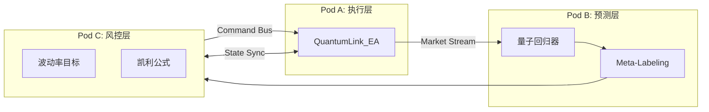

# 基于 Apple M2 Pro 架构的生产级量子高频交易系统

## 中间件 API 方案与全域落地实施深度报告

---

## 1. 执行摘要：从概率优势到工程韧性的跨越

在金融科技的前沿领域，高频交易（HFT）与量子机器学习（QML）的融合正处于从实验室原型向生产级系统过渡的关键阶段。

本报告旨在针对基于 Apple M2 Pro 芯片架构构建的高频量子交易系统，提供一份详尽的架构审计、中间件设计与落地实施方案。基于对提供的技术文档的深度剖析，我们识别出当前系统虽然在量子预测模型的构建上展现了前瞻性，但在从"离线预测"向"实盘交易"转化的过程中，面临着**通信延迟**、**数值精度稳定性**以及**全域风险控制**三大核心挑战。

### 核心论点

生产级系统的构建不仅仅是算法的堆叠，更是对**计算物理学**、**计算机体系结构**与**金融微观结构理论**的深度整合。

针对 M2 Pro 的统一内存架构（UMA）与异构核心特性，我们提出了一套 **"量子-经典双优侧车架构"（Quantum-Classical Dual-Optimization Sidecar Architecture）**：

- 通过引入基于 **ZeroMQ** 的 **Q-Link 中间件协议**，实现了 MetaTrader 5（MT5）执行端与 Python 量子预测端的微秒级解耦
- 通过强制采用 **CPU 纯算方案（Scheme C）** 与 **双精度（Float64）** 运算，规避了 GPU 加速带来的梯度噪声风险
- 通过构建独立于预测模型的 **"三道防线"风控体系**，解决了"裸露 Alpha"带来的生存危机

本方案详细阐述了如何通过操作系统级的**核心绑定（Core Pinning）策略**，压榨 M2 Pro 芯片 Firestorm 核心的极限性能，同时利用 E-Cores 处理统计风控任务，从而在保证系统**反脆弱性（Antifragility）**的前提下，实现数学期望的正向增长。

---

## 2. 战略背景与系统约束的物理学分析

在深入中间件 API 的代码级实现之前，我们必须首先在物理与数学层面解构系统的运行环境与约束条件。

### 2.1 量子优势与"贫瘠高原"的数值博弈

量子神经网络（QNN），特别是变分量子电路（VQC），其核心优势在于能够将经典金融数据映射到极高维度的**希尔伯特空间（Hilbert Space）**。然而，这种数学上的优雅在工程实现上极其脆弱。

- 随着量子比特数的增加，损失函数的梯度面会变得极度平坦，即所谓的 **"贫瘠高原"（Barren Plateaus）** 现象
- 金融数据的信噪比（SNR）极低，微观结构信号往往淹没在随机游走的噪声中
- Apple **MPS 后端缺乏对 Float64 的原生支持**，在量子金融计算中是致命的陷阱

> [!IMPORTANT]
> 生产系统的算力基础必须建立在支持全链路 Float64 运算的 CPU 架构之上，利用 PennyLane 的 `lightning.qubit` 后端配合 M2 Pro 的 NEON 指令集。

### 2.2 Apple M2 Pro 异构架构的调度挑战

Apple M2 Pro 芯片采用了典型的 ARM big.LITTLE 异构架构：

| 核心类型 | 代号 | 特点 |
|---------|------|------|
| **P-Cores** | Firestorm | 高性能核心，用于计算密集型任务 |
| **E-Cores** | Icestorm | 高能效核心，用于后台任务 |

**调度风险**：macOS 的 XNU Kernel Scheduler 倾向于将负载波动较大的进程调度至 E-Cores。如果量子推理线程在等待行情 Tick 的间隙被迁移至 E-Cores，延迟可能高达 **10-50 毫秒**。

> [!WARNING]
> 中间件方案的设计必须包含操作系统级的干预机制，通过 `taskpolicy` 接口强制锁定核心亲和性（Affinity）。

### 2.3 "裸露 Alpha"与风险控制的正交性

预测模型（Alpha）与风控模型（Risk）在数学上是**正交**的：

- **Alpha 模型**：拟合一阶矩（方向），极高难度
- **Risk 模型**：关注二阶矩（波动率），相对确定

当前系统如果仅依赖量子模型的点预测进行交易，实际上处于一种 **"裸露 Alpha"** 的状态。根据**凯利公式**，长期来看必然导致资金的几何级数衰减。

---

## 3. 架构设计：量子-经典双优侧车模式 (The Sidecar Pattern)

我们否定了单体架构和云端架构，提出了一种基于本地进程间通信（IPC）的 **"侧车模式"**。

### 3.1 架构拓扑与进程隔离



| 层级 | 宿主进程 | 核心绑定 | 职责 |
|------|---------|---------|------|
| **执行层 (Pod A)** | MT5 Terminal | P-Core #0 | 订单路由、行情订阅 |
| **预测层 (Pod B)** | Python | P-Cores #1-7 | 量子态演化计算 |
| **风控层 (Pod C)** | Python | E-Cores | Meta-Labeling、波动率计算 |

### 3.2 中间件选型：ZeroMQ 的必然性

**ZeroMQ (ZMQ)** 在 TCP Loopback 模式下，能够实现**微秒级**的传输延迟，同时提供：

- **PUSH/PULL 模式**：解决生产者快于消费者的背压问题
- **High Water Mark**：防止内存溢出导致的系统崩溃
- **无代理（Brokerless）**：降低架构复杂度

---

## 4. 中间件 API 方案：Q-Link 协议规范

### 4.1 通信通道拓扑设计

| 通道名称 | 端口 | ZMQ 模式 | 数据流向 | 阻塞属性 | 设计意图 |
|---------|------|---------|---------|---------|---------|
| **Market Stream** | 5557 | PUSH/PULL | MT5 → Python | 非阻塞 | 高频 Tick 传输 |
| **Command Bus** | 5558 | PUSH/PULL | Python → MT5 | 非阻塞 | 交易指令传输 |
| **State Sync** | 5559 | REQ/REP | 双向 | 阻塞 | 账户状态同步 |

### 4.2 数据序列化策略

#### 4.2.1 高频行情数据：紧凑 CSV 格式

```
TICK,1703123456789,XAUUSD,2050.12,2050.42,15,0.45,12.5,1.02
```

| 字段 | 说明 |
|------|------|
| Header | 固定为 `TICK` |
| Timestamp | 64位整数（毫秒） |
| Symbol | 交易品种 |
| Bid, Ask | 买卖价 |
| Volume | 成交量 |
| F_WickRatio | 影线比率 |
| F_VolDensity | 成交量密度 |
| F_VolShock | 成交量冲击 |

#### 4.2.2 控制指令：JSON 格式

**订单指令 Schema**：
```json
{
  "uuid": "a1b2-c3d4-e5f6",
  "action": "OPEN", 
  "symbol": "XAUUSD",
  "side": "BUY", 
  "type": "MARKET",
  "lots": 0.15,
  "sl": 2045.50,
  "tp": 2060.00,
  "magic": 999001,
  "comment": "QNN_Signal_v2"
}
```

**账户状态 Schema**：
```json
{
  "balance": 10000.00,
  "equity": 9950.20,
  "margin_free": 9500.00,
  "positions": []
}
```

---

## 5. 生产级系统落地：MT5 客户端工程实现

### 5.1 事件驱动的非阻塞架构

**QuantumLink_EA** 采用完全异步的事件驱动架构：

| 阶段 | 触发条件 | 职责 |
|------|---------|------|
| `OnInit` | EA 初始化 | 绑定 ZMQ Socket，设置 HWM=1000 |
| `OnTick` | 新 Tick 到达 | 检测新 K 线、计算特征、非阻塞发送 |
| `OnTimer` | 10-20ms 定时器 | 轮询指令、异步执行订单 |

### 5.2 关键代码逻辑实现

```cpp
//+------------------------------------------------------------------+
//| QuantumLink_EA.mq5 核心逻辑片段
//+------------------------------------------------------------------+
#include <Zmq/Zmq.mqh>

Context context("QuantumLink");
Socket pushSocket(context, ZMQ_PUSH);
Socket pullSocket(context, ZMQ_PULL);
Socket repSocket(context, ZMQ_REP);

void OnTick() {
    // 1. 数据采集：仅处理已完成的K线以确保特征稳定 
    if(!IsNewBar()) return;
    
    // 2. 链上特征计算：利用C++性能优势 
    double wick_ratio = CalculateWickRatio(); 
    double vol_density = CalculateVolumeDensity();
    
    // 3. 序列化：紧凑CSV格式
    string packet = StringFormat("TICK,%I64d,%s,%.5f,%.5f,%I64d,%.4f,%.4f",
                                 GetMicrosecondCount(), _Symbol, 
                                 SymbolInfoDouble(_Symbol, SYMBOL_BID),
                                 SymbolInfoDouble(_Symbol, SYMBOL_ASK),
                                 TickVolume, wick_ratio, vol_density);
                                 
    // 4. 非阻塞发送：HFT的生存法则 
    pushSocket.send(packet, true); 
}

void OnTimer() {
    // 5. 订单总线轮询
    ZmqMsg msg;
    while(pullSocket.recv(msg, true)) {
        string json_order = msg.getData();
        ExecuteOrderAsync(json_order);
    }
}
```

---

## 6. 生产级系统落地：量子 Alpha 引擎实现

### 6.1 纯 CPU 方案的工程胜利

我们坚决选择 **Scheme C（纯 CPU 方案）**：

| 问题 | GPU 方案 | CPU 方案 |
|------|---------|---------|
| **精度** | Float32 导致模拟漂移 | Float64 全链路精度 |
| **传输税** | CPU↔GPU 张量同步开销大 | 无传输开销 |
| **后端** | Apple MPS | `lightning.qubit` |

### 6.2 特征嵌入与微分策略

1. **稳态化**：原始价格转换为对数收益率或均线差
2. **角度嵌入**：$\theta = x_{\text{norm}} \times \pi$
3. **伴随微分**：10-100 倍训练加速

---

## 7. 生产级系统落地：全域风控引擎实现

### 7.1 第一道防线：元标记 (Meta-Labeling)

基于 XGBoost 的二分类模型，预测"量子模型这次是否可靠"。

- **阈值**：$P(\text{Correct}) > 0.6$ 时才允许信号通过

### 7.2 第二道防线：波动率目标与凯利公式

**波动率缩放**：
$$Size_{\text{Target}} = \frac{\text{Target Volatility}}{\text{Current Volatility}} \times \text{Capital}$$

**凯利调整**：
$$Size_{\text{Final}} = Size_{\text{Target}} \times (2p - 1)$$

### 7.3 第三道防线：微观结构流动性风控 (L-VaR)

如果 `预测收益 (Alpha) < 隐含滑点 + 手续费`，风控引擎直接否决交易指令。

---

## 8. 生产级系统落地：硬件级调优与部署

### 8.1 核心绑定策略 (Core Pinning)

```bash
#!/bin/bash

# 启动量子 Alpha 引擎 (预测)
python3 -u alpha_engine.py &
PID_ALPHA=$!

# 强制绑定到 P-Cores (Firestorm)
sudo taskpolicy -b -p $PID_ALPHA
sudo taskpolicy -t 5 -p $PID_ALPHA
echo "Alpha Engine (PID $PID_ALPHA) 已锁定至 P-Cores。"

# 启动风控引擎
python3 -u risk_engine.py &
PID_RISK=$!

# 绑定到 E-Cores (Icestorm)
sudo taskpolicy -t 1 -p $PID_RISK
echo "Risk Engine (PID $PID_RISK) 已锁定至 E-Cores。"
```

### 8.2 并行线程控制

```bash
export OMP_NUM_THREADS=6    # 假设有 6 个 P-Cores
export OMP_PROC_BIND=true   # 防止线程漂移
```

### 8.3 运维韧性设计

| 机制 | 触发条件 | 动作 |
|------|---------|------|
| **延迟看门狗** | Tick 延迟 > 100ms | 进入安全模式，仅允许平仓 |
| **死人开关** | 心跳超时 > 5s | 清空所有持仓并停止运行 |

---

## 9. 结论

本报告提供了一套完整的、基于 Apple M2 Pro 架构的高频量子交易系统落地方案：

- ✅ **侧车模式** 架构创新
- ✅ **Q-Link 协议** 微秒级数据吞吐
- ✅ **硬件核心绑定** 与 **全域风控** 实施

这套方案在数学原理与物理约束层面实现了逻辑闭环，为量子金融从理论走向实战提供了一条切实可行的路径。